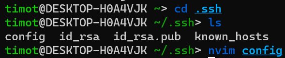
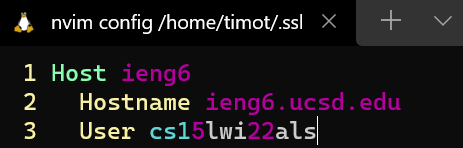
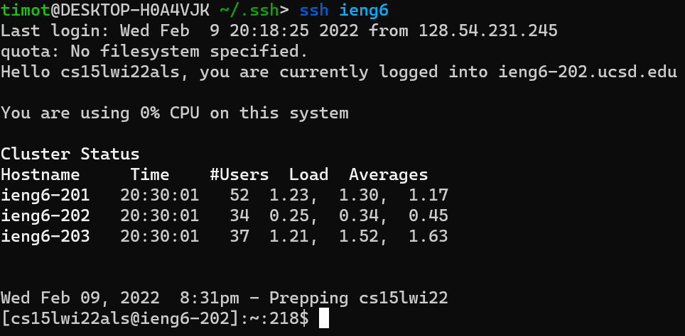
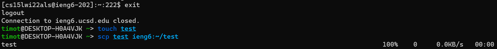
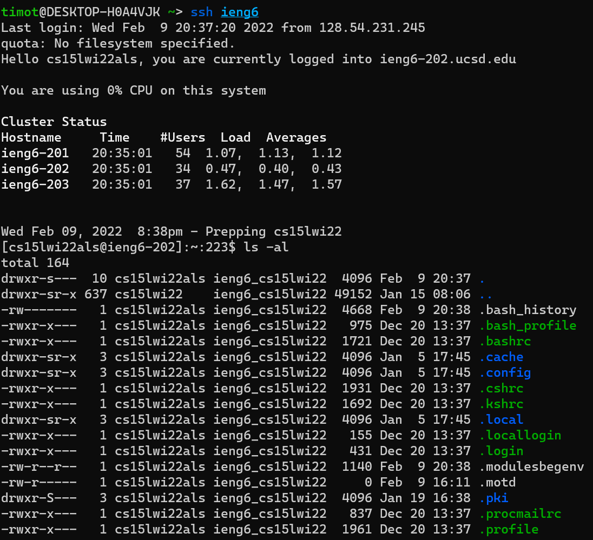
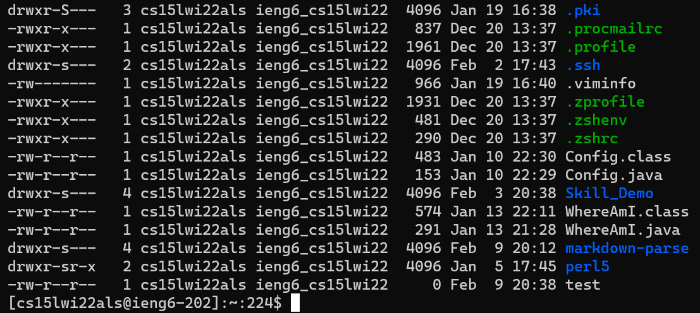

[Return to Lab Reports Main Page](../index.md)
## Lab Report 3, Timothy Chu

# Set the Host up in config


* Step 1: Go to your ``.ssh/config`` file. This is where you will set your host up.


* Step 2: Add in the following in your ``config`` file in the ``.ssh``:
  *  In the first line, put ```Host <alias>```, which will be your alias to get into the server
  *  In the second line, put ```Hostname <address to server>```, which will be the address of the host (\<username\>@\<host address\>)
  *  In the last line, put ```User <username>```, which is the username you log in with on the host (\<username\>@\<host address\>)

# ssh command log in


* This shows that we can use the alias of the host to be able to log in to the server without needing to enter the user information.

# scp command


* type the ``exit`` command to log out of the ssh server. On the local machine, do the following:
  * Step 1: do ``touch <filename>`` to create a new file with the name <filename>.
  * Step 2: run ``scp <filename> <alias>:~/<filename``. This command will copy the file /<filename/> to the server and and copy it into the home directory of 
  the server with the same <filename>.


* Log into ssh to see the file <filename> copied onto the server.


* Doing the ``ls -al`` command, it will show us the files in the current home directory and the times that it was changed. As you 
can see, the ``test`` file has been added onto the server. It has been succesfully added with the file's most recent changes.
