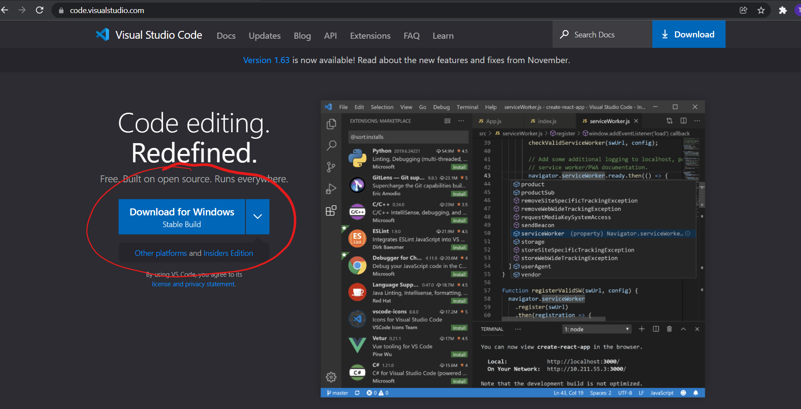
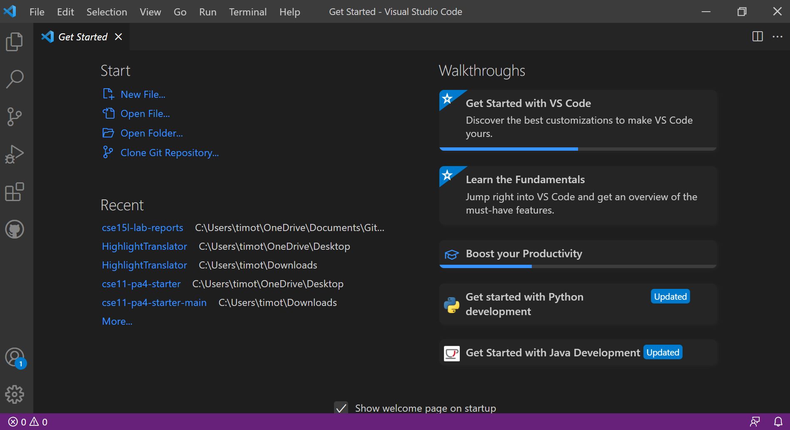
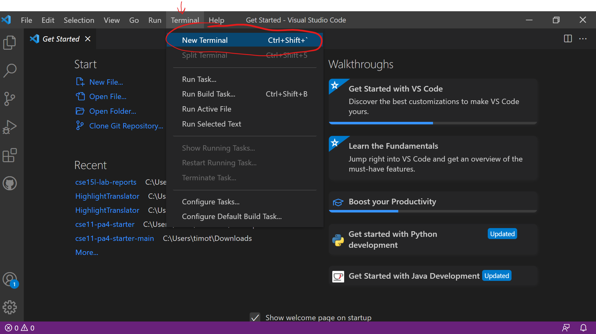
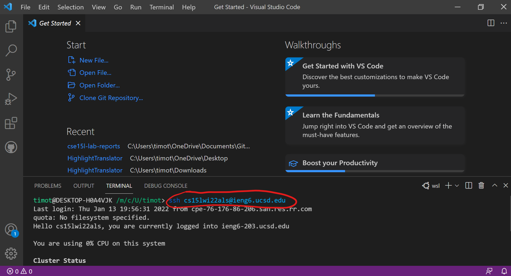
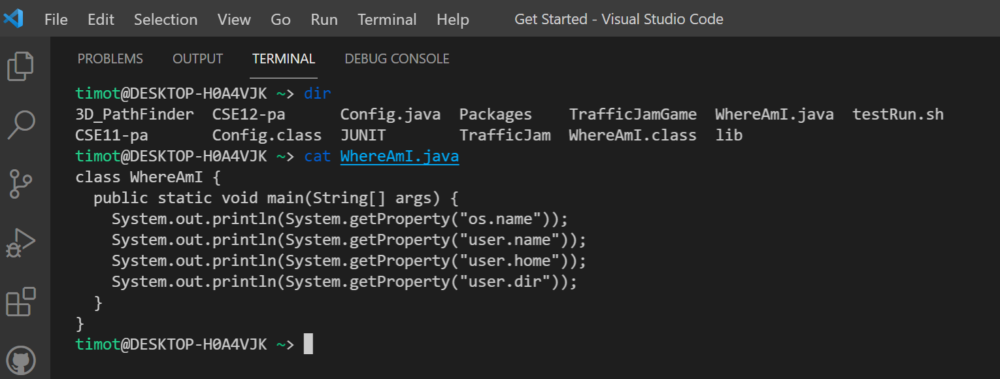
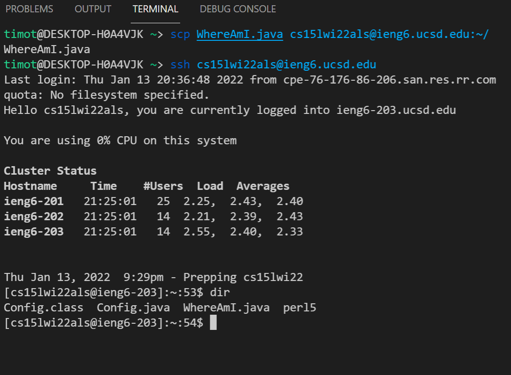
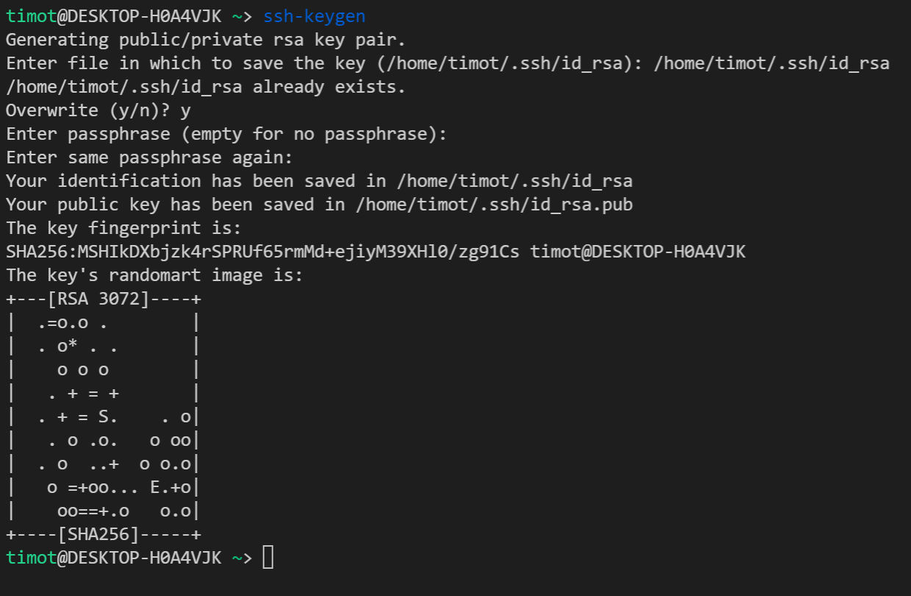
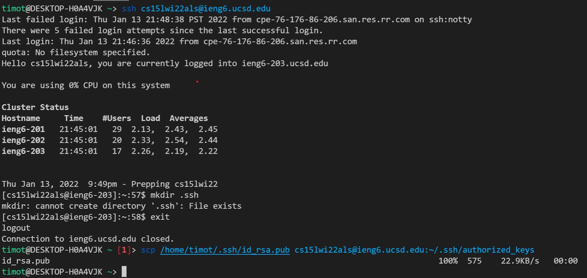
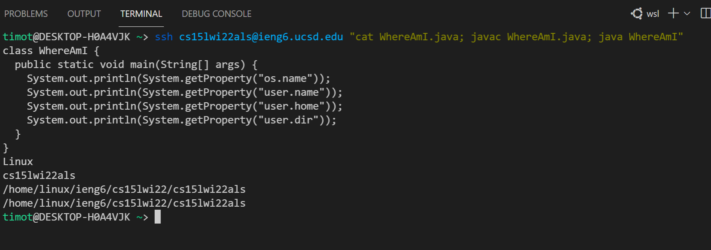

## By: Timothy Chu
# Installing VScode
* Click this [link](https://code.visualstudio.com/) to install VScode

* When you launch the app, it should look like the following:

#  Remotely Connecting
* To remotely connect to a server, first open a new terminal from VScode

* In the terminal, type ``ssh`` and your [UCSD address](https://sdacs.ucsd.edu/~icc/index.php) for the CSE15L class 
  * (enter password and enter yes if prompted)

  * It should greet you with a Hello message signaling you that you are logged into the server.
 
# Trying Some Commands
 
 * ``dir`` shows the directory of the given path, in the example, the path is ``~``
 * ``cat`` followed by \<name of file\> shows the contents of the file 📂 
 
# Moving Files with scp
 
 * ``scp \<name of file\> \<name of ssh user\>`` copies the file to the user's home directory
 * It is shown when logging back with ``ssh`` and entering ``dir`` that the file is in the home directory of user

# Setting an SSH Key
* Not logged into ``ssh``, type in ``ssh-keygen`` to generate a key for logging in without a password

  * save the key to the path in (\<path\>)
  * enter a blank passphrase
* copy the key by doing ``mkdir .ssh`` in the ``ssh``, logout and enter ``scp \<key-gen path\> \<server name\>:~.ssh/authorized_keys``

# Optimizing Remote Running
* after the ``ssh \<name of ssh user\>`` adding commands in quotes will run in the user's server at start

