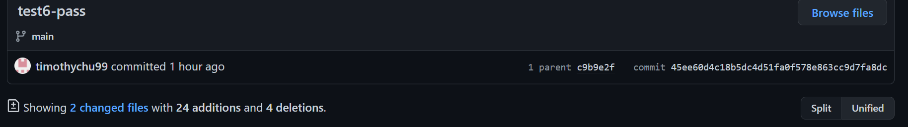
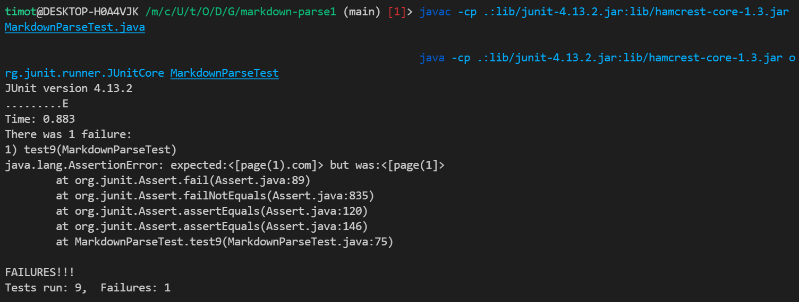
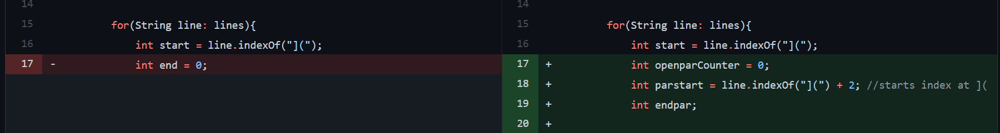
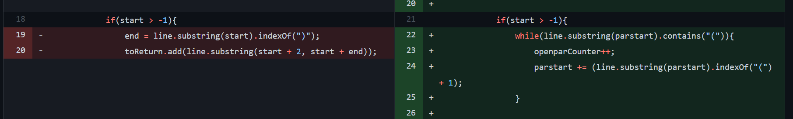
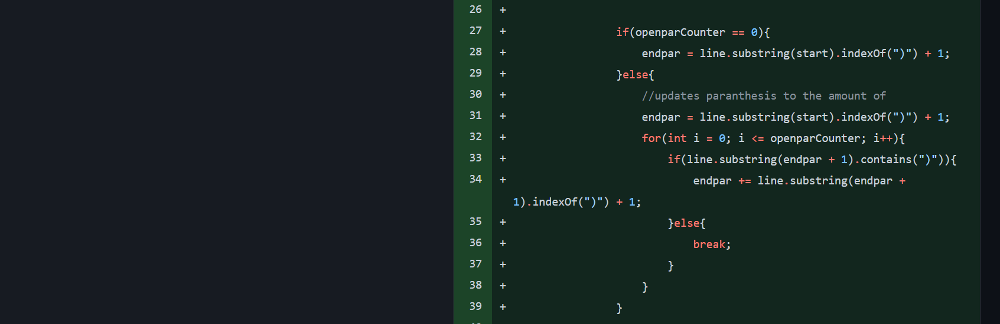
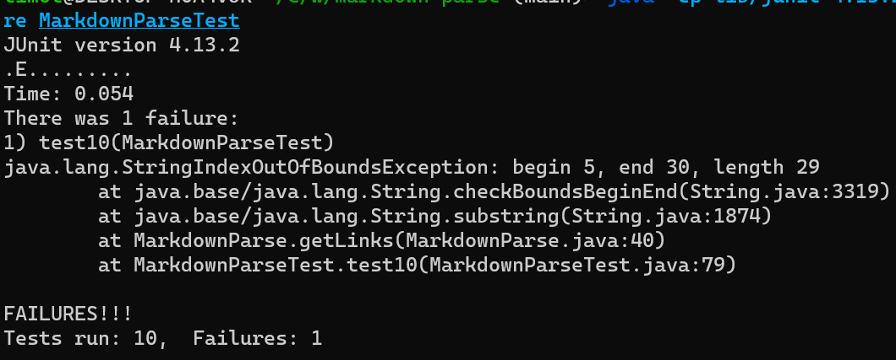
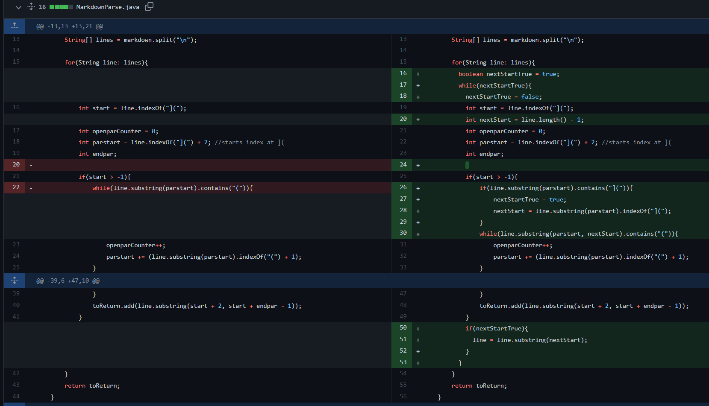

## Timothy Chu
* No bugs for all the test-files passed for my Markdown.java file, so I made my own test files

# Bug 1: can not support closed paranethesis in the links
* Committed one file that made test 9 work
 
    * (commit message supposed to say test-9 pass)
 
## Fail-inducing Input and Output for all Changes
- failure-inducing input: test-file9 [test-file9](https://raw.githubusercontent.com/timothychu99/markdown-parse/main/test-file9.md)
    - input: ``[](page(1).com)`` expect: ``[page(1).com]``
- failure-inducing output: 

## Change 1: Create counter variables to track the paranthesis
 
 * test-file9 (above) failed at tracking the amount of paranthesis in ``[](page(1).com)``
 * The bug is that the ``getLinks()`` method ends the link at the nearest ``)``. The symptom is that the  ``getLinks()`` method only tracks until the first ``)`` and only produces a fail-inducing output if their is more than one ``)`` in the link. It prompted me to create variables to track the paranthesis in the links.
 
## Change 2: Update openparCounter to count the amount of `(` in the link
  
 * test-file9 (above) failed at tracking the amount of paranthesis in ``[](page(1).com)``
 * Running the failure-induced output helped me find out what the symptom was from what the input produced. The symptom that I encountered of having multiple ``)`` in the links showed that the bug was that I forgot to track if the ``)`` was part of the link. It sparked my idea to track the amounts of ```(``` that were inside the link to determine where the end of the link is.

## Change 3: Set the end index of link to the last ``)`` of the link 
 
 * test-file9 (above) failed at tracking the amount of paranthesis in ``[](page(1).com)``
 * The failure-inducing output showed some symptoms such as addressing that there may be lingering ``)`` that can infect the program output. The bug of having
to track if the ``)`` is part of a bracket ``(<words>)``. The bug of not tracking the bracket relationships within the links made me fix this issue.

# Bug 2: can not have multiple links on the same line
 - failure-induce-input: test-file10 [test-file10](https://raw.githubusercontent.com/timothychu99/markdown-parse/main/test-file10.md)
    - input: ``[](page.com) [](page.com)`` expect: ``[page.com, page.com]``
 - failure-inducing output: 
 - one commit to make test_10 pass:
   - 
 * 
 * test-file 10 (above) failed to be able to detect multiple links on one line which was ``[](page.com) [](page.com)``
 * The failure-inducing output showed some symptoms such as not addressing other links because it was programmed to only track 1 link. The bug was found out from what the failure-inducint output printed. The failure-inducing output was found out from the failure-inducing input of a line with multiple links. So any line with multiple links is a failure inducing input that causes an output of that only expected one link. The output bug is that the program did not address cases of multiple links for a line. To fix the bug, I made the program count the amount of links the program needed to find per line.

# Bug 3: can not have spaces in the links
